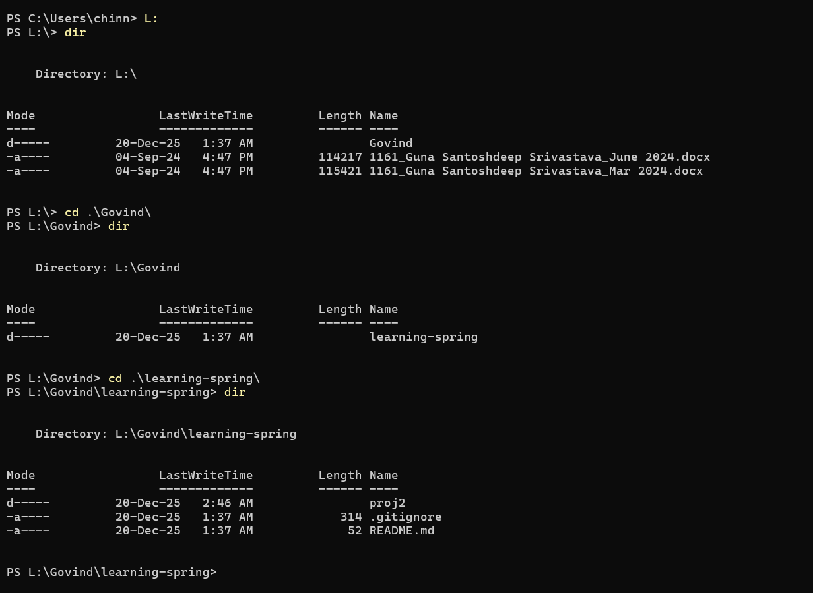

# learning-spring
Learning Net bean in springboot
# CMD Basics 

| Command         | Purpose                              |
| --------------- | ------------------------------------ |
| `dir`           | List files & folders                 |
| `cd foldername` | Go into a folder                     |
| `cd ..`         | Go back one folder                   |
| `cd \`          | Go to root directory                 |
| `cls`           | Clear screen                         |
| `tree`          | Show folder structure                |
| `explorer .`    | Open current folder in File Explorer |

if we want to open my project inside the vs code means cmd -> project path and enter `code .`

